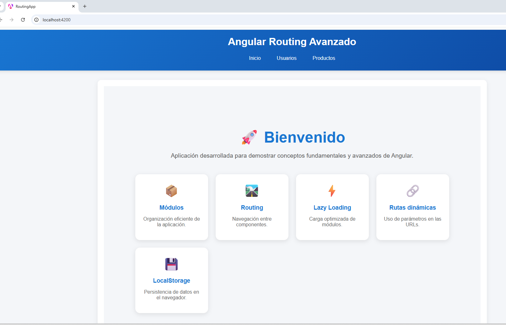
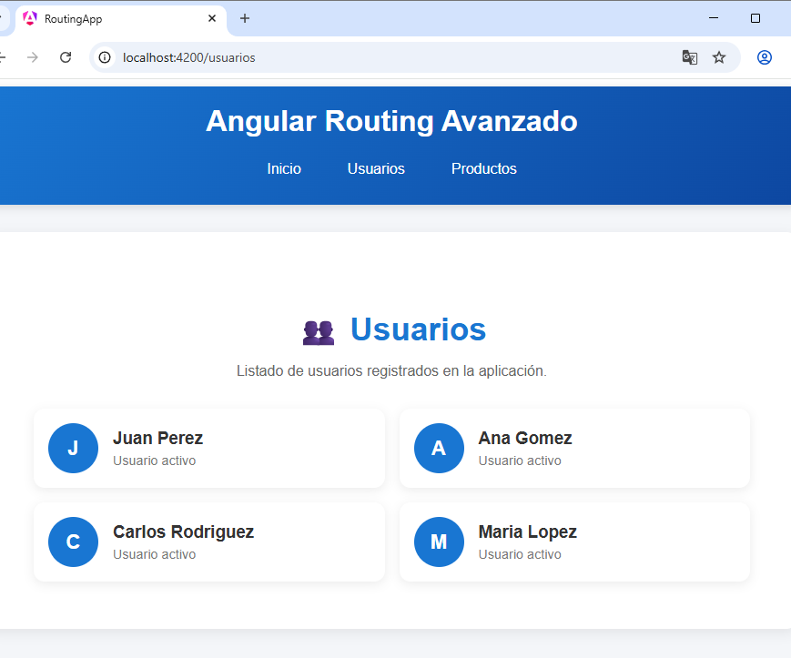
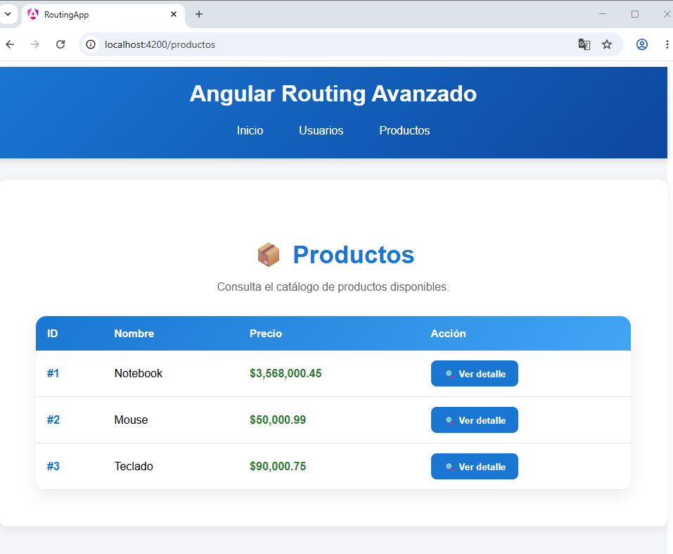
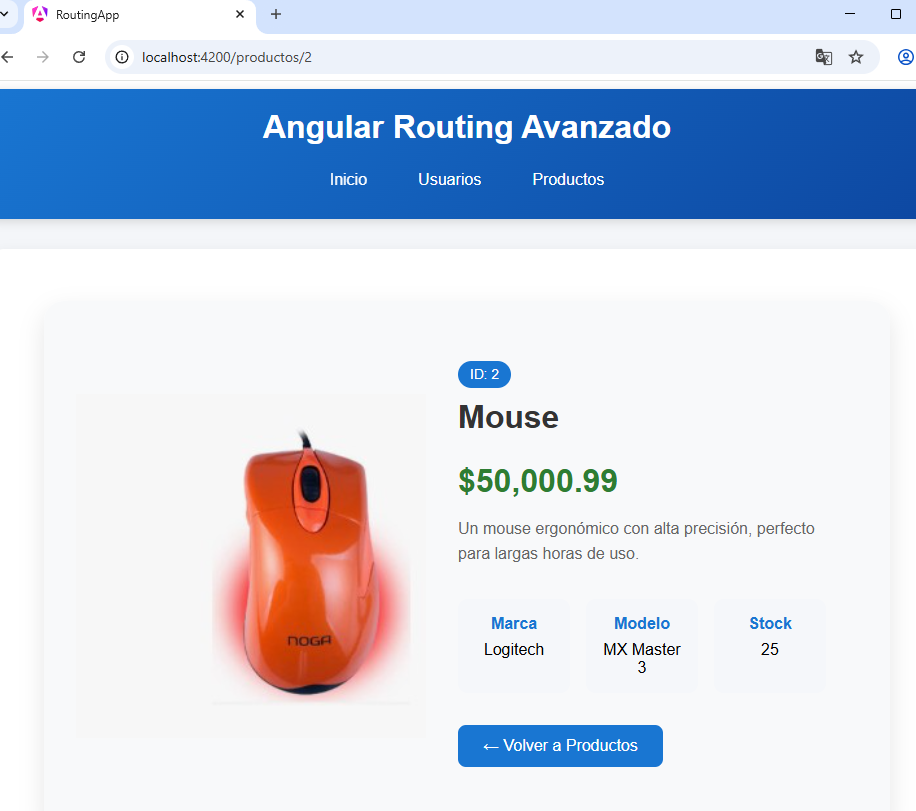

##Angular Avanzado - Routing y Navegación
## Descripción del proyecto

Este proyecto fue desarrollado con Angular 21 utilizando Standalone Components y tiene como objetivo aplicar conceptos avanzados de enrutamiento (Routing) en Angular.

La aplicación implementa:
- ✅Navegación entre vistas mediante Angular Router.
- ✅Lazy Loading de componentes.
- ✅Rutas dinámicas utilizando parámetros (/productos/:id).
- ✅Uso de routerLink y router-outlet.
- ✅Persistencia de la última sección visitada mediante localStorage.
- ✅Redirección automática a la última ruta visitada al recargar la aplicación.

## Tecnologías utilizadas
Angular 21
TypeScript
Angular Router
HTML5
CSS3
LocalStorage API
## Instalación y ejecución
### 1. Clonar el repositorio

```bash
git clone https://github.com/abenitezS/productos-app.git
cd productos-app
```

### 2. Instalar dependencias

```bash
npm install --legacy-peer-deps
```

### 3. Ejecutar en modo desarrollo

```bash
npm run start 
```

Abrir en el navegador: [http://localhost:4200](http://localhost:4200)

---
## Funcionalidades implementadas
- Inicio: Pantalla principal de bienvenida.

- Usuarios: Visualización de una lista de usuarios mediante navegación interna.

- Productos: Visualización de productos disponibles.

- Detalle dinámico: Cada producto posee una ruta dinámica: /productos/:id  que permite visualizar información específica según el identificador recibido.

- Persistencia de navegación: La aplicación almacena la última ruta visitada en localStorage y la recupera automáticamente al volver a cargar la página.

## Capturas de pantalla
- Inicio
      
Pagina de inicio 

- Usuarios
      
 Muestra  la sección Usuarios

- Productos
      
Muestra la  sección Productos

- Detalle de Producto
      
Muestas  pantalla de la ruta dinámica /productos/:id

## Despliegue
- Plataforma elegida: Vercel

https://routing-app-beta.vercel.app

## Créditos del autor

- **Estudiante:** Alicia Benitez
- **Curso:** Angular Avanzado
- **Unidad:** Módulo 1 — Unidad 4: Aplicación modular con rutas y almacenamiento en navegador

--- 

## Bibliografía y fuentes consultadas
### Documentación oficial
- Angular. Routing Guide. https://angular.dev/guide/routing
- Angular. Standalone Components. https://angular.dev/guide/components/importing
- Angular. Lazy Loading. https://angular.dev/guide/routing/common-router-tasks
- Angular. Deployment Guide. https://angular.dev/tools/cli/deployment
## Referencias adicionales
- MDN Web Docs. localStorage API. https://developer.mozilla.org/en-US/docs/Web/API/Window/localStorage
- MDN Web Docs. sessionStorage API. https://developer.mozilla.org/en-US/docs/Web/API/Window/sessionStorage
